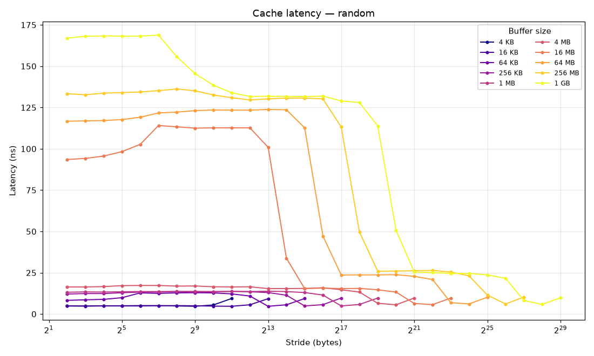
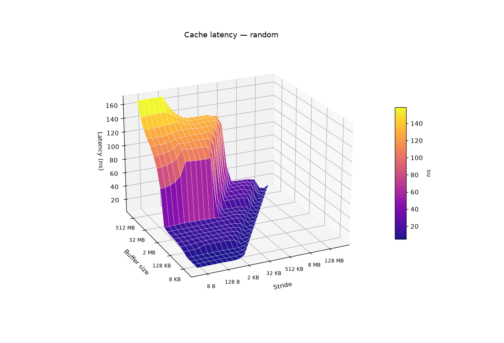
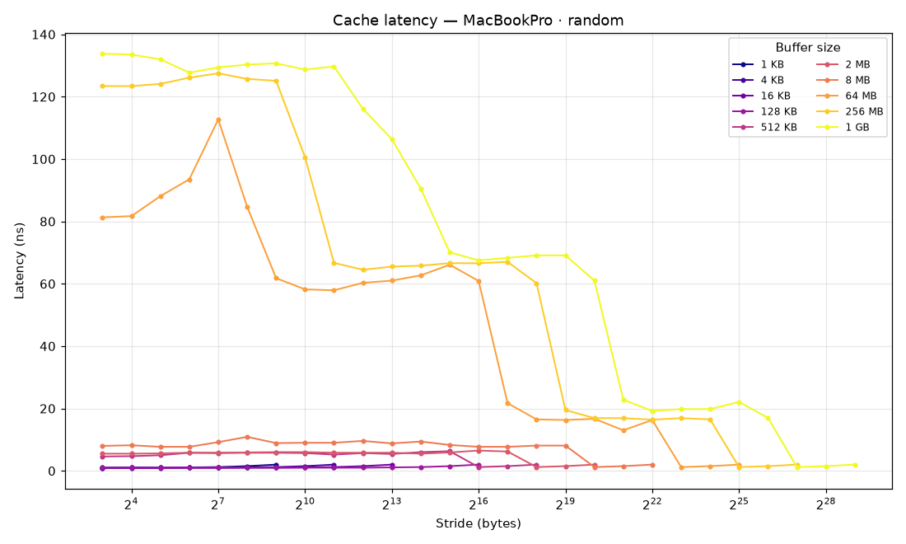
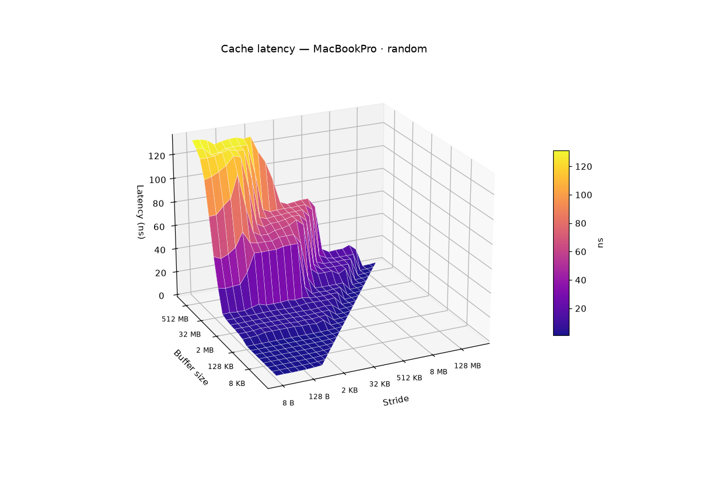

# Cache

## Memory-Hierarchy Understanding Tools

A small C program that times pointer-chasing through differently-sized
buffers, and a Python post-processor that reads the resulting numbers
and infers the cache hierarchy of the machine they were taken on.

I first saw the technique used for generating these latency numbers in
exercise 5.2 on page 476 of
[Computer Architecture: A Quantitative Approach](http://www.amazon.com/gp/product/0123704901)

## Theory

The idea comes from the [Ph.D. dissertation](http://portal.acm.org/citation.cfm?id=170337) of
Rafael Héctor Saavedra‑Barrera:

> Assume that a machine has a cache capable of holding D 4‑byte
> words, a line size of b words, and an associativity
> a. The number of sets in the cache is given by D/ab. We
> also assume that the replacement algorithm is LRU, and that the lowest
> available address bits are used to select the cache set.
>
> Each of our experiments consists of computing many times a simple
> floating-point function on a subset of elements taken from a
> one-dimensional array of N 4-byte elements. This subset is
> given by the following sequence:
>
> 1, s+1, 2s+1, ..., N-s+1
>
> Thus, each experiment is characterized by a particular value of
> N and s. The stride s allows us to change the rate at
> which misses are generated, by controlling the number of consecutive
> accesses to the same cache line, cache set, etc. The magnitude of
> s varies from 1 to N/2 in powers of two.

Depending on the magnitudes of N and s relative to D, b, and a, four
regimes appear:

| Size of Array |    Stride    | Frequency of Misses          | Time per Iteration |
|---------------|--------------|------------------------------|--------------------|
| 1 ≤ N ≤ D     | 1 ≤ s ≤ N/2  | no misses                    | T                  |
| D < N         | 1 ≤ s ≤ b    | one miss every b/s elements  | T                  |
| D < N         | b ≤ s < N/a  | one miss every element       | T + M              |
| D < N         | N/a ≤ s ≤ N/2| no misses                    | T                  |

Every regime is visible in the plots below.

## How it works

`cache.c` allocates a 1 GB array of pointers and, for each `(buffer
size, stride)` pair, threads a randomly-shuffled linked list through the
positions `{1, s+1, 2s+1, …}` of that buffer. It then walks the list:

```c
for (p = start; p; p = (u32 **)*p) ;
```

Every load address depends on the previous load's result, so the CPU
can't prefetch, reorder, or speculate its way out of the actual
hierarchy latency. The walk runs until at least one second of wall
time has accumulated; the average per-access cost is what gets
written.

The output is a three-column TSV (`stride`, `buffer`, `ns`) with double
blank lines between buffer sizes — exactly what gnuplot wants as an
`index`-separated block file. `analyze.py` reads that same file back
and:

- groups buffer sizes whose small-stride latency stays flat (those are
  one cache level); a jump ends the group;
- looks for the stride at which each row reaches ~95 % of its peak —
  that's the cache line size;
- looks for the right-edge collapse where latency drops back to ≈ L1 —
  that's `buf / a` for L1 associativity;
- subtracts row floor from row peak in the smallest DRAM-region buffer
  to estimate the TLB miss penalty.

## Running it

```sh
make run                       # 1 GB random walk + report + plots (~minutes)
make run BUFFER=67108864       # 64 MB only (faster, less of the hierarchy)
make run GHZ=2.6               # also report cycles, not just ns
```

`make run` calls `./cache -o results/<host>-<timestamp>`, then
`analyze.py` against the resulting file, then `analyze.py --plot 3d`
and `--plot 2d` into `images/`. Matplotlib lives in a local
`uv`-managed virtual environment so nothing leaks into your system
Python.

You can also run them à la carte:

```sh
./cache -o results/foo                       # write data file
uv run python analyze.py results/foo         # report only
uv run python analyze.py results/foo --plot 3d -o out.png
```

## Example 1 — a 2008 Core 2 Duo

Running against `results/MACOS_RAND_REBOOT` (a Core 2 Duo T7800 at
2.6 GHz, captured after rebooting into single-user mode):

```
  level       buffer range    latency (ns)         cycles
  ------  ----------------  --------------  -------------
  L1          4 KB – 32 KB             4.9             13
  L2          64 KB – 4 MB      8.3 – 16.4        22 – 43
  memory       8 MB – 1 GB    68.2 – 167.0      177 – 434

  derived
    line size           64 B            (consensus: 6 rows)
    L1 associativity    8-way           (consensus: 12 rows)
    TLB miss penalty   ~33 ns          (at 8 MB buffer)

  notes
    L2 latency floor (8.3 ns) is at the previous-level boundary;
      typical L2 hit cost in mid-region is closer to ~12 ns
```

The numbers match the published spec for the T7800: 32 KB L1, 4 MB L2,
64-byte lines, 8-way L1 associativity. The L2 latency range — 8 to 16
ns — *is* the answer; the spread is the truth. The 8.3 ns floor sits
at the 64 KB buffer (just over L1) where some accesses still get L1
hits; the 16.4 ns ceiling sits at the 4 MB buffer where TLB pressure
has crept in. Reporting only one number would be lying.

### 2D — stride vs. latency, one line per buffer size



Read each line left-to-right at its buffer size:

- **Cool-colored lines at the bottom** are buffers that fit in L1 (4 KB
  – 32 KB). They sit flat near 5 ns regardless of stride: every access
  is a hit. This is row 1 of the regime table.
- **Mid-band lines at ~13 ns** are L2-resident (64 KB – a few MB).
  They slope up gently as stride grows because line crossings increase,
  but stay well below DRAM cost.
- **Warm-colored lines** (16 MB – 1 GB) start at the DRAM access
  latency (≈ 70 ns), climb to a TLB-pressure peak around 100–170 ns at
  page-sized strides, then **fall off a cliff** at very large strides.
  That cliff is Saavedra's regime 4 — once stride ≥ buffer / associativity,
  the walked elements all land in one cache way and fit in L1 again,
  so the trip back down hits ≈ 5 ns. The cliff happens at
  `stride = buffer / 8`, which is how the analyzer reads off L1
  associativity.

### 3D — the same data as a surface



The "valley" at the front-bottom-left is L1 territory: small buffers,
any stride, ~5 ns. The first **step up** is the L1→L2 boundary; the
**back cliff** is the L2→DRAM boundary. The bright ridge along the
right-back is the TLB-stressed peak. The right-edge **slope back down
to L1 height** is regime 4 again, viewed as a continuous surface
instead of a per-line drop.

In one picture: the cache hierarchy of a 2008 laptop.

## Example 2 — an Apple M1 Max in 2026

The same `make run`, on a MacBook Pro 14" (Apple M1 Max, P-cores up to
~3.2 GHz). The data file is `results/M1MAX_RANDOM`:

```
  level       buffer range    latency (ns)         cycles
  ------  ----------------  --------------  -------------
  L1         1 KB – 128 KB       0.9 – 1.0          3 – 3
  L2         256 KB – 8 MB       3.5 – 8.0        11 – 26
  L3?                16 MB            26.7             85
  L4                 32 MB            50.6            162
  memory      64 MB – 1 GB    81.3 – 133.8      260 – 428

  derived
    line size           16384 B           (consensus: 5 rows)
    L1 associativity    8-way           (consensus: 13 rows)
    TLB miss penalty   ~31 ns          (at 64 MB buffer)
```

A few things worth pointing out, because they're real *and* because
some of them are where the analyzer's heuristics start showing their
edges:

- **L1 hit at ~1 ns / 3 cycles** matches the published Apple M1 L1d
  latency. The analyzer caps L1 at 128 KB because that's the largest
  power-of-two buffer that still fits; the real M1 P-core L1d is
  192 KB, and the true boundary lives between 128 KB and 256 KB (the
  next doubled buffer). The interval-bracketed table is honest about
  that.
- **L2 ≈ 12 MB at ~6 ns / 19 cycles** — analyzer reads 8 MB because
  that's the largest tested buffer that still fits cleanly; the actual
  M1 Max P-cluster L2 is 12 MB.
- **The `L3?` and `L4` rows are Apple's System-Level Cache** (~48 MB
  on M1 Max, shared across the whole SoC), not separate caches. The
  analyzer flags `L3?` because that plateau is only one buffer wide
  and its latency sits closer to a cache than to DRAM — it's the "you're
  starting to spill out of L2 into SLC" zone. The 50 ns `L4` row is
  "fully in SLC". Together they describe the SLC's partial-fill
  behavior; the heuristic doesn't know about SoC-wide last-level
  caches.
- **"Line size: 16384 B" is wrong.** The M1 cache line is 128 B; what
  the heuristic actually detected is the **16 KB page size** — Apple
  Silicon uses 16 KB pages by default, so the TLB-miss knee sits at
  stride 16 KB and drowns out the line-size knee at 128 B. A better
  detector would search for a *second* knee earlier in the rising
  portion of each row. (Open todo.)
- DRAM at ~80 ns and the Saavedra regime-4 right-edge collapse are
  still perfectly readable — they outlive any number of cache-design
  generations.

### 2D — M1 Max



Notice how flat the bottom cluster is — L1 lines for buffers up to
128 KB are nearly indistinguishable at ~1 ns. The orange "8 MB" line
is the interesting one: starts at ~5 ns (still in L2), climbs steeply
once stride pushes accesses through 16 KB pages, then collapses near
the right edge. The 64 MB / 256 MB / 1 GB lines all show the SLC +
DRAM ramp, and you can see two distinct downhill steps on the way
back to L1: one drop down to the SLC plateau (~20 ns), and a second
drop down to L1 (~1 ns).

### 3D — M1 Max



Compared to the Core 2 surface above, this one has **two cliffs in
the back** instead of one. The first cliff is the L2→SLC transition;
the second is SLC→DRAM. The front-bottom plateau is also shallower
because L1 is sub-nanosecond. The right-edge slope back to L1 is
still there: Saavedra's regime 4 isn't going anywhere.

## Limitations and caveats

- **Single-user mode helps.** With the OS scheduler hopping you onto
  different cores, page-coloring randomness, etc., you'll see noisier
  plateaus. The Knoppix dataset in `results/KNOPPIX_RAND_DIRAC` shows
  this — the analyzer flags a phantom "`L3? = 4 MB`" plateau that the
  Core 2 doesn't actually have. It's probably TLB pressure plus
  randomness, and the `?` suffix tells you that.
- **The L1 floor latency is real**; the L2 floor latency is an artifact
  of the L1/L2 boundary. The analyzer says so in the notes block when
  the spread is wide enough to warrant it.
- **Sequential walks** used to be a separate mode but were dropped.
  The hardware prefetcher streams the access pattern at small stride,
  so the cache structure is hidden — sequential data can't tell you
  line size or associativity. Random walks see everything sequential
  walks see, plus what sequential walks miss.
